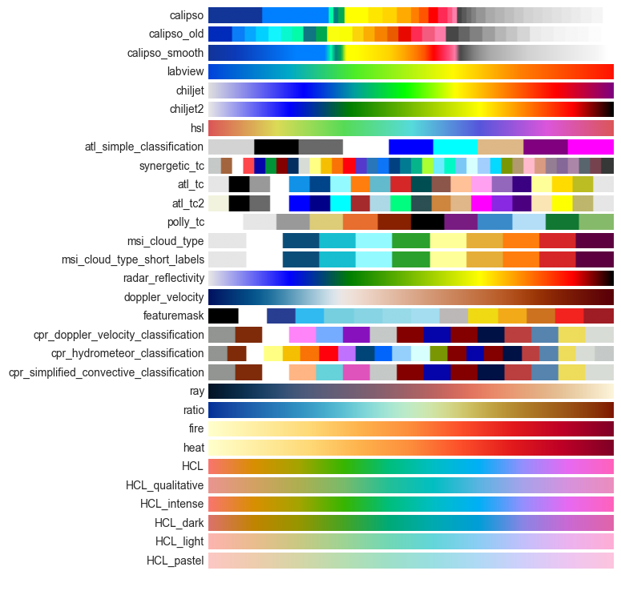

# Colormaps

Figure objects such as [`CurtainFigure`][earthcarekit.CurtainFigure] accept `matplotlib.colors.Colormap` objects or a name string, which then retrieves the appropriate colormap from [`matplotlib`](https://matplotlib.org/stable/users/explain/colors/colormaps.html#), [`plotly`](https://plotly.com/python/builtin-colorscales/), [`cmcrameri`](https://github.com/callumrollo/cmcrameri), and from a list of pre-defined colormaps for `earthcarekit`:

{ .skip-lightbox }

!!! Advanced
    In case you want to get an `matplotlib.Colormap` object and call by name, use the [`get_cmap`][earthcarekit.get_cmap] function.

    All pre-defined colour tables for `earthcarekit` are also listed in [`earthcarekit.cmaps`][earthcarekit.cmaps].

## Categorical colormaps

For classification data (e.g., ATLID target classification) categorical colormaps can be created using the [`Cmap.to_categorical`][earthcarekit.Cmap.to_categorical] method:

```python
cmap = eck.get_cmap("viridis")
values_to_labels = {
    0: "class 1",
    1: "class 2",
    100: "class 3",
    -1: "missing data",
}
cmap_categorical = cmap.to_categorical(values_to_labels)

# Example plot
eck.CurtainFigure().plot(
    values=[[-1,  0,  1, 100],
            [ 1, -1,  1,   0],
            [ 0,  1, -1,   1]],
    height=[5e3,15e3, 25e3, 35e3],
    time=["20250101", "20250201", "20250301"],
    cmap=cmap_categorical,
)
```

## Shifting the midpoint

See [`shift_cmap`][earthcarekit.shift_cmap].

```python
def plot_cmap(c):
    import matplotlib.pyplot as plt
    _, ax = plt.subplots(figsize=(6, 0.5))
    plt.colorbar(plt.cm.ScalarMappable(cmap=c), cax=ax, orientation="horizontal", label=c.name)
    plt.show()

cmap = eck.get_cmap("RdBu")
plot_cmap(cmap)

cmap_shifted = eck.shift_cmap(cmap, midpoint=0.2, name="RdBu_shifted")
plot_cmap(cmap_shifted)
```